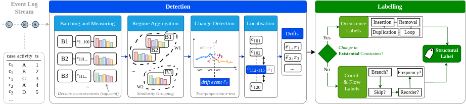

# DeclareCascade



Most concept-drift detectors for business processes answer *whether* and *when* the process
changed. They rarely say **what** changed - and when a change type has to be named, the labels
used across the literature are often ambiguous, inconsistent between approaches, or simply
undefined for the case where several structural effects happen at once. This repo tackles both
problems for **sudden drifts** by reading the change directly off the process's declarative
(Declare) model.

**Disclaimer.** We use one fixed configuration across all datasets, with no
per-dataset tuning. [`sweep-analysis.pdf`](sweep-analysis.pdf) is the paper's supplementary
material for this choice: independent sweeps of the intensity threshold, trailing-window width,
batch size, statistical confidence, and localisation policy, each centred on the selected default
and reporting how F1 and Average Lag move around it.

## Overview

The pipeline has two stages:

**Detection.** The event stream is consumed online, in batches of consecutive cases. For each
batch, the support and confidence of the `Existence`/`Choice`/`ChainResponse`/`Response` Declare relations between
every pair of activities are measured (*Batching and Measuring*). A pooled two-proportion z-test,
governed by a statistical confidence `K`, asks batch by batch whether a relation's rate has moved
by more than sampling noise can explain - the required shift shrinks automatically as the batch
grows (*Change Detection*). A sequential detector fires when the evidence agrees, re-anchors past
the change, and a confirmation step (gated by an intensity threshold `ξ`) separates genuine drift
events from noise while grouping the surrounding cases into clean *before* and *after* regimes and
localising the drift to a case index (*Regime Aggregation* / *Localisation*).

**Labelling.** Each confirmed drift is described by exactly which Declare constraints were born,
died, or shifted between its two regimes - the *change signature*. **DeclareCascade** routes this
signature through an ordered cascade of predicate gates, each one a lens over one
family of Declare relations. It looks first at activity **occurrence** (did an activity appear,
vanish, or change how many times it repeats - insertion, removal, duplication, loop,
substitution?), and only if occurrence doesn't account for the change does it move to
**coordination and process flow** (did two activities start/stop co-occurring, did an activity
become optional, did an order invert, or did only relative frequencies shift - branch, skip,
reorder, frequency?). Because the gates are ordered and each reads a distinct set of changed
constraints, the outcome is a **single deterministic label per drift**, and that label is directly
traceable back to the Declare evidence that produced it.

Evaluated end-to-end against the [cdrift benchmark](#comparing-against-other-detectors) (Bose,
Ceravolo, Ostovar), the detector reaches accuracy and F1 comparable to state-of-the-art drift
detectors, while additionally producing the constraint-level, structural explanation those
detectors don't. Full numbers, figures and the labelling breakdown are in
[Results](#results). 

## How to run

Requires Python ≥ 3.10. This is a set of flat scripts under `scripts/`, not an installable
package - `pyproject.toml` exists only for the dependency list and the `ruff`/`pytest`
configuration; nothing needs to be installed to run them.

```bash
pip install numpy pandas pulp scipy      # runtime (scipy only needed for --test fisher)
pip install pytest ruff                  # to run the tests / linter
```

### Benchmark data

The evaluation logs and the other detectors' results are not part of this repo. Clone the
benchmark at the repo root before running anything below:

```bash
git clone https://github.com/cpitsch/cdrift-evaluation.git
```

### Quickstart

```bash
# detection: F1 + Average Lag on all datasets -> results/cdrift-eval.csv
python3 scripts/evaluate_cdrift.py

# labelling: per-leaf precision/recall/F1 for the DeclareCascade gates
python3 scripts/diagnose_decision_tree.py --dataset both --sizes 1000 --level LEAVES

# head-to-head vs. the cdrift benchmark methods
python3 scripts/compare_to_cdrift.py

# regenerate every figure in results/figures/
python3 scripts/make_figures.py

# end-to-end sanity check on synthetic logs with known change points
python3 scripts/synthetic_eval.py

# unit tests for the vendored cdrift scoring
python3 -m pytest
```

The rest of the evaluation suite (ablations, sweeps, runtime, traceability) is listed in
[Files](#files) below, next to the results it produces.

## Files

| file | role |
|---|---|
| `scripts/log_io.py` | minimal XES log reader |
| `scripts/batch_support_series.py` | batches a log and measures the per-batch `ChainResponse`/`Response` support+confidence series |
| `scripts/detect_drift_incremental.py` | two-proportion z-test + the sequential detector that fires, confirms and localises change points |
| `scripts/signature.py` | builds the before/after regime profiles and the change signature the labelling gates read |
| `scripts/diagnose_decision_tree.py` | the DeclareCascade labelling gates, plus every evaluation mode (`--level`) |
| `scripts/cdrift_approach.py` | the detector wrapped in the cdrift benchmark's `detect(log)` interface |
| `scripts/evaluate_cdrift.py` | scores detection with the cdrift benchmark's own F1 + Average Lag (verbatim) |
| `scripts/compare_to_cdrift.py` | head-to-head vs. the benchmark methods - see [Comparing against other detectors](#comparing-against-other-detectors) |
| `scripts/channel_ablation.py` | support-only vs. confidence-only vs. both-channels ablation |
| `scripts/label_accuracy.py` | ambiguity-aware labelling accuracy against the benchmark's ground-truth pattern codes |
| `scripts/ambiguity_analysis.py` | how often more than one gate fires on the same drift, and whether it still resolves correctly |
| `scripts/traceability_examples.py` | qualitative examples tracing a label back to its Declare evidence |
| `scripts/runtime_benchmark.py` | wall-clock and throughput benchmark |
| `scripts/param_sweeps.py` | one-at-a-time sweeps over the intensity threshold, trailing-window width, batch size and localisation policy |
| `scripts/write_param_sweeps_snippet.py` | LaTeX table generator for the sweep results |
| `scripts/make_figures.py` | generates every figure under `results/figures/` |
| `scripts/synthetic_eval.py` | end-to-end check on synthetic logs with known change points |
| `tests/test_scoring.py` | pytest suite pinning the vendored cdrift scoring functions |

### Comparing against other detectors

`scripts/compare_to_cdrift.py` scores DeclareCascade against the nine detectors benchmarked by
Adams et al. in **[cdrift-evaluation](https://github.com/cpitsch/cdrift-evaluation)**, reading
their published `algorithm_results.csv` directly from that repo. It is a like-for-like
re-derivation under one consistent scoring recipe, not a reproduction of the paper's own ranking -
the script's header documents exactly where and why the two diverge (per-log macro F1 vs. their
pooled micro F1, all 151 logs vs. their 41-log noiseless subset, a best configuration chosen per
dataset).

## Results

### Detection (cdrift F1 / Average Lag, lag = 200 cases)

| dataset | F1 | Avg Lag (cases) |
|---|---|---|
| Ceravolo-1000 | **0.911** (best of 10) | **5.7** (best) |
| Ostovar | **0.922** (2nd of 10) | **20.7** (best) |
| Bose | 0.800 | 100 |

Mean F1 **0.878** - 3rd of the 10 benchmarked methods, with no per-dataset tuning. On a permutation
null over the real Ceravolo logs, the confidence channel's realized false-positive rate runs ~15×
nominal (activations cluster within cases rather than behaving as independent Bernoulli trials),
so `K` should be read as bounding the support channel, not the two channels jointly.

### Figures (`results/figures/`)

All figures reuse the cdrift scoring functions verbatim, so DeclareCascade and every baseline are
scored identically.

- **`fig1_detection_prf`** - grouped precision/recall/F1 bars, DeclareCascade vs. the strongest
  baselines, one panel per multi-log dataset (Ceravolo, Ostovar); Bose gets its own
  `fig1_detection_prf_bose`.
- **`fig2_labelling_by_group`** - labelling accuracy by pattern-mechanism group (single-mechanism /
  ambiguous / composite / frequency / inexpressible), unambiguous vs. ambiguity-resolved correct
  calls, pooled across datasets.
- **`fig3_cd_ceravolo` / `fig3_cd_ostovar` / `fig3_cd_pooled`** - critical-difference diagrams
  (Friedman + Nemenyi post-hoc) over per-log F1: average rank per method, with cliques of
  statistically indistinguishable methods.
- **`fig4_labelling_by_group_per_dataset`** - figure 2's groups split Ostovar vs. Ceravolo, since
  the pooled view hides large per-dataset splits.
- **`fig5_param_sweeps`** - mean F1 (top row) and mean localisation error (bottom row) across four
  one-at-a-time sweeps: intensity threshold, trailing-window width, batch size, and localisation
  policy, Ceravolo vs. Ostovar. The localisation-policy sweep reports `start`/`mid`/`end`/`adaptive`
  only: `end` (the default) gives by far the lowest lag on both datasets, `adaptive` doesn't beat
  it, and neither changes *which* drifts are detected - the policy only moves the reported index
  within the firing batch.

### Labelling and ablations

Ambiguity-aware labelling accuracy (`results/label_accuracy_summary.csv`), scored against 176
ground-truth drifts: **0.506** exact accuracy overall (0.571 Ceravolo, 0.462 Ostovar). 61% of
scored drifts trip more than one gate (`results/ambiguity_summary.csv`); of those, 38% still
resolve to the correct label. Per-leaf precision/recall (`results/experiment-B-leaves.txt`) is
strongest on **Reorder** (F1 0.83) and **Branch** (0.74), weakest on **Insertion** (0.13), which
absorbs most of the false positives from ambiguous occurrence drifts.

Channel ablation (`results/channel_ablation.csv`) - support alone reaches F1 0.907/0.935
(Ceravolo/Ostovar) with a *lower* lag than the combined channels; confidence alone is markedly
weaker (0.689/0.847). The two channels together buy precision, not F1, over support alone.

Runtime (`results/runtime_summary.csv`) - median end-to-end latency per batch ranges from ~0.1s
(Ceravolo) to ~2.3s (Ostovar, whose logs are far larger), at throughputs of 1.3k–11k cases/second.

Parameter-sweep findings, including which of the paper's own claims the sweeps confirm or
contradict, are written up in full in `results/param_sweeps_findings.md`.


### `results/` folder map

| path | contents |
|---|---|
| `cdrift-eval.csv`, `cdrift-eval-*.csv` | per-log detection results at the default config and at each swept localisation policy |
| `cdrift-comparison.txt` | head-to-head F1/lag table vs. the 9 cdrift baselines, plus per-log correlation |
| `figures/` | the figures described above, `.png` and `.pdf` |
| `label_accuracy_results.csv` / `_summary.csv` | per-drift and aggregate labelling accuracy |
| `ambiguity_results.csv` / `_summary.csv`, `cross_dataset_consistency.csv` | multi-gate ambiguity analysis |
| `channel_ablation.csv` | support/confidence/both ablation |
| `runtime_results.csv` / `_summary.csv` | wall-clock and throughput benchmark |
| `traceability_examples.json` | worked examples tracing a label back to its Declare evidence |
| `param_sweeps.csv`, `param_sweeps_rows.csv`, `param_sweeps_snippet.tex` | parameter-sweep data and generated LaTeX |
| `param_sweeps_findings.md` | narrative write-up of the sweep results |
| `experiment-*.txt`, `localisation-summary.txt` | raw console output of each evaluation run |

## License

MIT - see [`LICENSE`](LICENSE). `cdrift-evaluation/` carries its own upstream licence.
